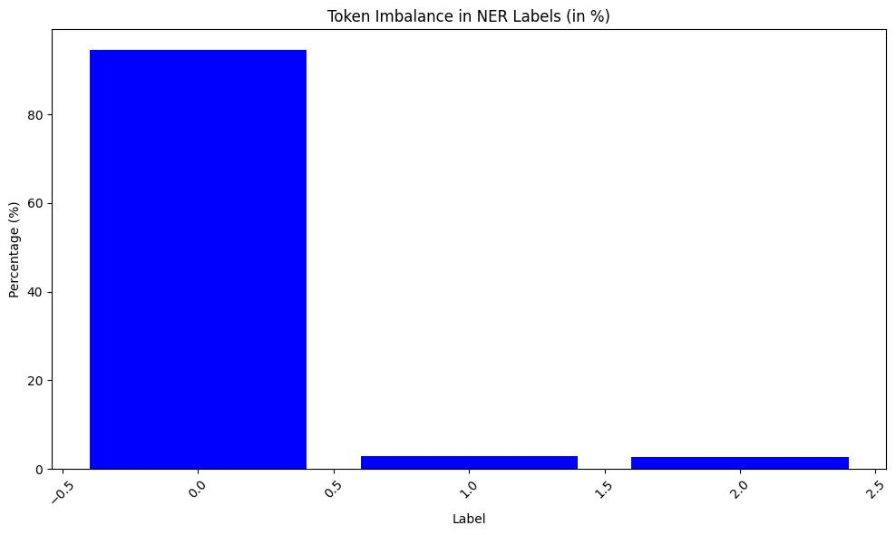

# Mountain NER (Named Entity Recognition) Project

This project aims to build a Named Entity Recognition (NER) model for detecting mentions of mountains in texts. It uses a fine-tuned BERT model to classify tokens into three categories: `B-Mountain` (beginning of a mountain entity), `I-Mountain` (inside a mountain entity), and `O` (other).

The project includes functionality to train the NER model on a custom dataset, generate synthetic data for additional training, and perform inference on new input sentences.

---

## Project Structure

```bash
NERofMountains/
│
├── dataset/                     # Datasets used for training and evaluation
│   ├── few-nerd/                
│   ├── resulting_dataset/       
│   ├── synthetic/               
│   └── wnut16/                 
│
├── logs/                        # Logs generated during training 
│   └── training.log             
│
├── src/                         
│   ├── configs/                 # Configs for dataset creation and model training/inference
│   │   ├── datagen.yaml         
│   │   └── model.yaml           
│   ├── notebooks/               
│   │   ├── dataset.ipynb        # Dataset creation 
│   │   ├── NERofMountainsDemo.ipynb # Demo
│   │   └── NERofMountainsTrainer.ipynb # Notebook for training
│   ├── SyntheticDataGenerator/  # Synthetic data generation
│   │   └── llm_generator.py     
│   ├── trainer/                
│   │   ├── inference.py         # Inference script
│   │   └── train.py             # Training script
│   │   └── weighted_train.py    # Training with class weights to deal with rare mountains occurances
│   └── utils/                   
│       ├── constants.py         # Constants used throughout the project
│       └── model_utils.py       # Helper functions for model loading and preprocessing
│
├── README.md                    
└── requirements.txt             
```

---

## Solution Overview

The project builds an NER model to detect mountain names in text. It uses [`dslim/bert-base-NER`](https://huggingface.co/dslim/bert-base-NER) as the base model and fine-tunes it for token classification tasks. The project includes:

1. **Dataset Preparation**: The final dataset was created from three sources - the [few-nerd dataset](https://huggingface.co/datasets/DFKI-SLT/few-nerd), [wnut16](https://github.com/aritter/twitter_nlp/tree/master/data/annotated/wnut16), and synthetic data generated using the `llm_generator.py` script. The few-nerd dataset contains samples with and without mountains, the synthetic dataset contains only samples with mountains, and WNUT 16 contains no sentences with mountains, serving as augmentation. The resulting dataset can be found [here](https://huggingface.co/datasets/telord/mountains-ner-dataset).



The dataset is balanced with respect to samples containing mountains (50/50), but the token distribution is highly imbalanced:
- `O`: 94.45%
- `B-Mountain`: 2.82%
- `I-Mountain`: 2.73%

2. **Model Training**: 
The project fine-tunes a BERT base model, originally pre-trained on the [CoNLL-2003 Named Entity Recognition dataset](https://aclanthology.org/W03-0419.pdf), and adapts it to a custom dataset. The model was trained both with and without class weights, achieving an F1 score of 0.91 on the validation set in both cases. Without class weights, the model reached this score after 3 epochs, while applying class weights proportional to label frequencies took 6 epochs to achieve the same result. 

Despite this, I believe the approach using class weights is more appropriate for our case, and the observed behavior may be linked to suboptimal hyperparameter selection, which requires further investigation. The final model, with class weight adjustments, is available [here](https://huggingface.co/telord/mountains-ner-model).

#### Training Configuration

The training settings are defined in `src/configs/model.yaml`. You can modify hyperparameters like `num_train_epochs`, `learning_rate`, and others to suit your needs.

Example configuration (`model.yaml`):

```yaml
model:
  model_name: "dslim/bert-base-NER"

hyperparameters:
  learning_rate: 2e-5
  num_train_epochs: 10
  per_device_train_batch_size: 16
  per_device_eval_batch_size: 16
  weight_decay: 0.01
  save_total_limit: 3
  logging_steps: 100
  metric_for_best_model: "f1"
  greater_is_better: true
  evaluation_strategy: "epoch"
  logging_strategy: "steps"
  save_strategy: "epoch"
  load_best_model_at_end: true

hf:
  data_path: "telord/ner-mountains-dataset"
  save_model_path: "telord/ner-mountains-model"
```

3. **Inference**: Once the model is trained, it can be used to predict mountain entities in new text inputs. The `inference.py` script allows for command-line predictions or integration into Jupyter notebooks. It is designed for single example inference but can be easily adapted for large-scale inference if needed.

---

## Setup

### 1. Clone the repository:

```bash
git clone https://github.com/te1ord/NERofMountains.git
cd NERofMountains
```

### 2. Install the required dependencies:

```bash
pip install -r requirements.txt
```

### 3. Setup Configuration:

You can customize the training and data generation settings via the configuration files located in `src/configs/`.

- **`model.yaml`**: Adjusts hyperparameters for training the NER model (epochs, batch size, learning rate, etc.).
- **`datagen.yaml`**: Defines parameters for generating synthetic data.

### 4. src folder:
The code is designed to be easily run from the source folder in the following way:

```bash
python folder-where-your-script-is-located/script.py
```

### 5. Training the Model:

To train the model, run:

```bash
python trainer/train.py
```

This will:
- Load the dataset
- Fine-tune the model
- Save the best model and tokenizer to the `./results` directory and push it to the hub defined in `model.yaml`

### 6. Running Inference:

To run inference on a specific sentence using the trained model, use:

```bash
python trainer/inference.py --sentence "Denali is the tallest mountain in North America."
```

This will output the detected mountain entities in the sentence:

Denali   : B-Mountain  
is       : O  
the      : O  
tallest  : O  
mountain : O  
in       : O  
North    : O  
America  : O  
.        : O  

## Results and Performance

The model achieves good accuracy in recognizing mountain names across different contexts. For evaluation, precision, recall, and F1 score metrics are logged after each epoch.

Example metrics from training:
- **Accuracy**: 0.987
- **Precision**: 0.909
- **Recall**: 0.915
- **F1 Score**: 0.912

## Inference Demo

To demonstrate inference in a Jupyter notebook, use the `NERofMountainsDemo.ipynb` notebook in the `notebooks/` directory. This shows how to pass sentences through the trained model and display entity predictions on samples from different parts of the dataset, as well as on new, unseen data.